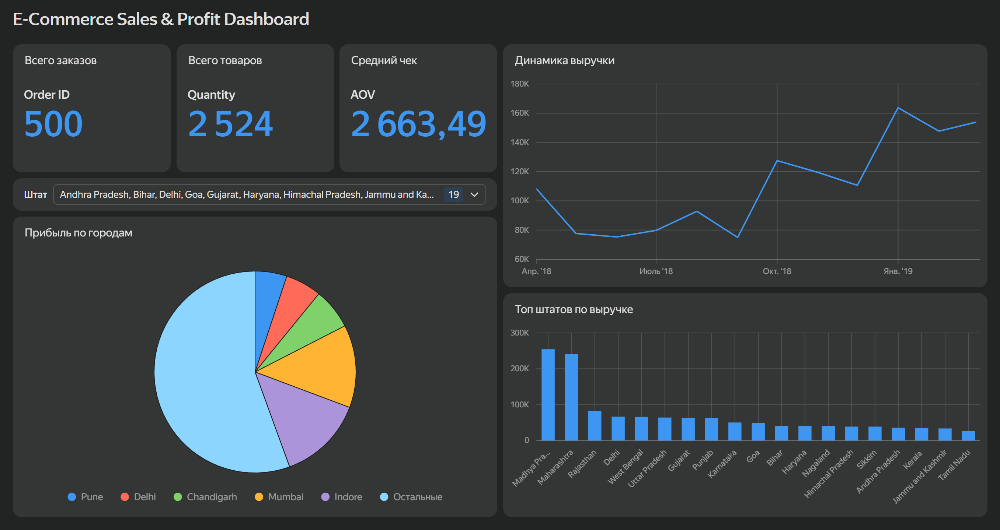

# Интерактивный дашборд продаж и прибыли (Yandex DataLens)

## Описание проекта
Интерактивный BI-дашборд для анализа ключевых бизнес-метрик интернет-магазина (выручка, прибыль, количество заказов, средний чек) на основе 500+ транзакций.

🔗 **[Открыть интерактивный дашборд в Yandex DataLens](https://datalens.yandex/ssn4s4dqj2sib?_share_link=public)**

---

## Внешний вид дашборда

---

## Используемый стек
- **Yandex DataLens** (визуализация, вычисляемые поля, селекторы)
- **Python / Pandas** (предварительное обогащение и подготовка данных)
- **GitHub** (документирование и хранение материалов проекта)

---

## Ключевые метрики и визуализации
1. **KPI-карточки:** Выручка, Прибыль, Количество заказов, Средний чек (AOV).
2. **Динамика выручки по месяцах:** Линейный график для отслеживания тренда продаж.
3. **Топ штатов по выручке:** Столбчатая диаграмма регионального лидерства.
4. **Структура прибыли по городам:** Круговая диаграмма с вычисляемым полем `Top-5` для чистой визуализации.
5. **Фильтрация:** Интерактивный селектор по штатам (`State`) для мгновенной детализации данных.
